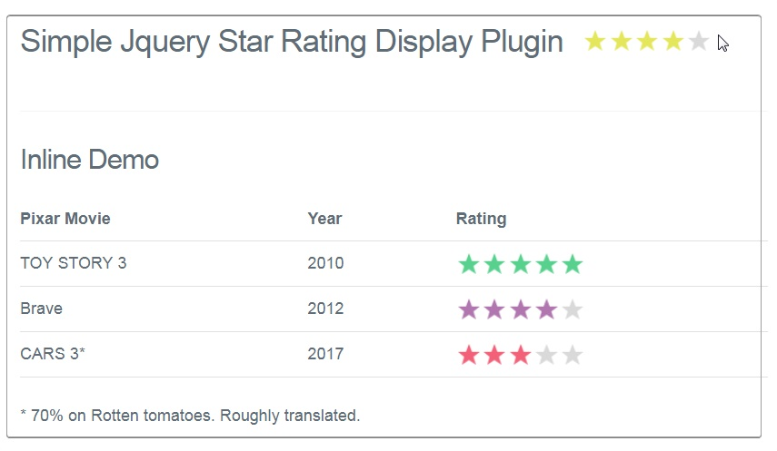

Simple star Rating Jquery Plugin v1.0
============

jQuery Class for simple **Star Rating** system.

## [Check the Demo here](https://monsterbrain.github.io/Simple-Star-Rating-Jquery-Plugin/)

[](https://monsterbrain.github.io/Simple-Star-Rating-Jquery-Plugin/)

## Usage
```$('.star_system').starRating();```

### disable animation
```$('.star_system').starRating({animated: false});```

## todo
- Half star rating to be included (use elegentstars.png if needed)
- Maybe a click and drag rating interaction, as an input element
- contributors are welcome

**Inspiration** : Found this cool stuff while surfing around. decided to modify it with
a demo and some use cases, so that anyone could find it useful.

*Readme by Author [Robert Rusu](https://github.com/rusuandreirobert)*

This is pretty flexible, and you can add stars anywhere on your website with just a div.
This script works pretty nice, I've used it in a previous project and it seemed like something practical.
Pretty much the only thing you have to do is set the star image patch in the function, and you're all set.
